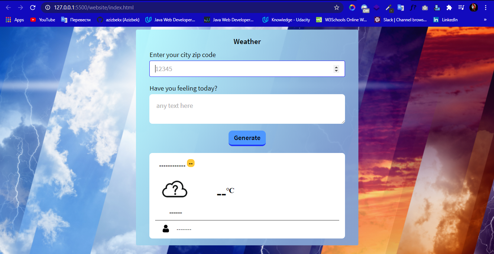
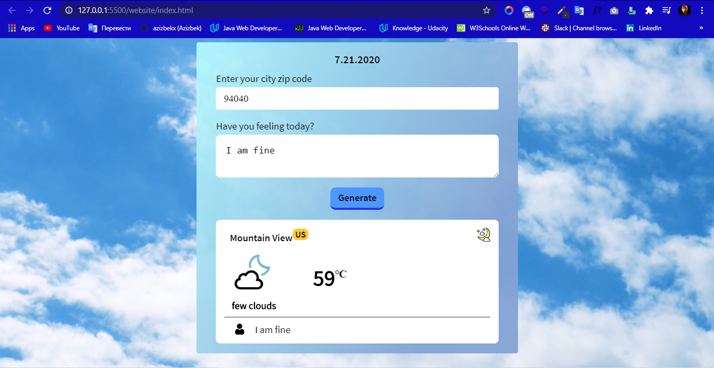

# Weather_App
 This Project Fron end Nanodegree programm 3-project in Udacity.com 

1. run server  `node server.js`.
2. Open Browser
3. Enter Zip code example  94040 - Mountana View
4. Wath and Enjoy Weather Information in Display 

## Home

## Result

